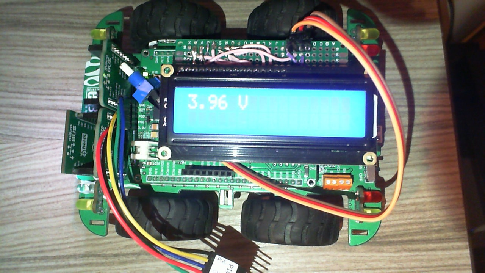
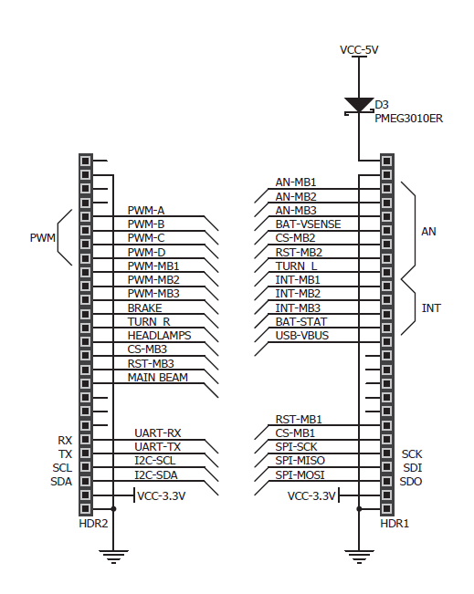
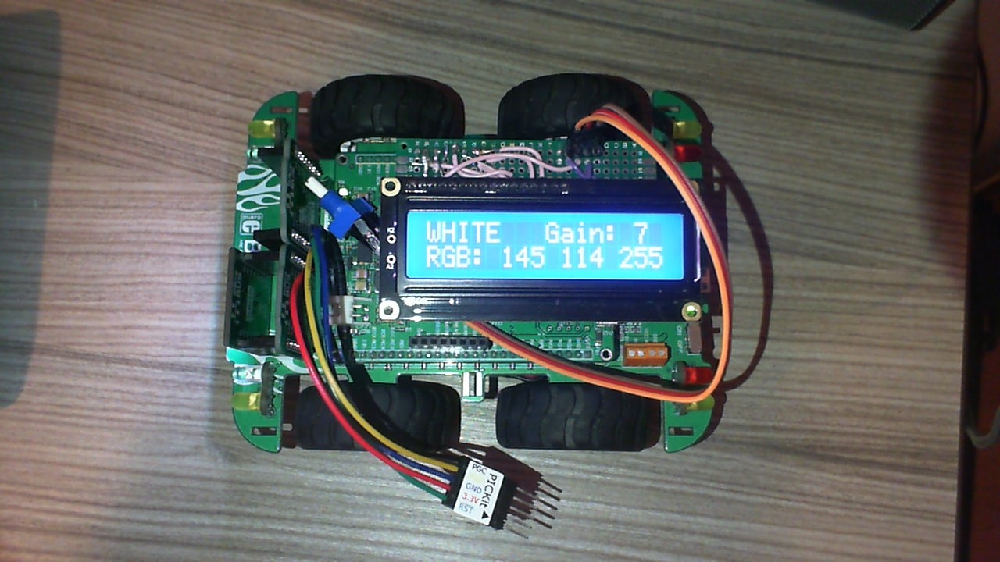
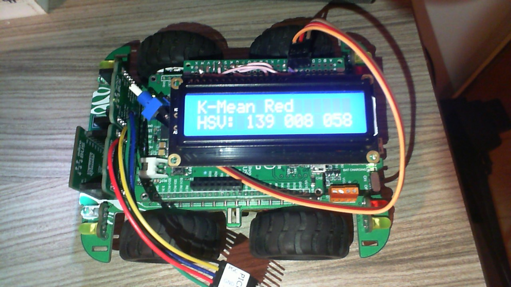

# Project Overview

## Challenge brief

This code is for the control of the prescribed Clicker 2 Buggy. The task is the navigation of a maze or "mine" environment,
taking direction and behavioural cues from mounted pieces of card. The colour of the card was detected using a
vision system which was capable of detecting levels of reflected light. The buggy was then designed to return to the start
position upon detection of a white coloured piece of card.

The buggy was designed to: 

1. Navigate towards a coloured card and stop before impacting the card
2. Read the card colour
3. Interpret the card colour using a predefined code and perform the navigation instruction
4. When the final card is reached, navigate back to the starting position
5. Handle exceptions and return back to the starting position if final card cannot be found

The following colour code was used for navigation:

Colour | Instruction
---------|---------
Red | Turn Right 90
Green | Turn Left 90
Blue | Turn 180
Yellow | Reverse 1 square and turn right 90
Pink | Reverse 1 square and turn left 90
Orange | Turn Right 135
Light blue | Turn Left 135 
White | Finish (return home)
Black | Maze wall colour

*Table 1: The mapping between card colour and following motor action.*

# Technical Description

## Motor Systems

### Low Level Functions

The motors on the left and right of the buggy were formulated as structures within the code, with member variables representing
parameters such as power, direction, and brake mode. Following initialisation, the motors on the buggy were controlled through a
cascade of functions operating at various levels of abstraction. A register on the PIC microcontroller cannot be changed directly
by changing the value of member variables. The lowest level function is setMotorPWM() which accepts a pointer to a motor structure,
and sets the value of the relevant registers according to the value of the structure members.

### Mid-Level Functions

Mid-level functions are then provided such as forward(), reverse(), turnLeft(), turnRight(), and stop(). These set the appropriate
power and direction variables within the passed structures and then call setMotorPWM() to update the registers. The stop function
was designed to gradually reduce the motor power over a period of a few milliseconds, thereby reducing the electrical burden upon
the system.

### High Level Functions

The highest level functions incorporate a timing element to the locomotive elements, enabling precise turning angles and forward
movements. Many of these functions are then wrapped in the final layer of 'colour' functions (i.e. red(), green()), which carry out
the required functionality described in Table 1.

The time and power could be passed as arguments to many of these functions, but generally the power was held at one of three constant
levels nominally defined as low, medium and high. A low power setting helped the buggy to avoid crashing into a maze wall prior to 
reading a colour. The buggy was required to make turning angles of 90, 135, and 180 degrees. This was achieved by adjusting the delay
between the motion call and stop call.

This delay was calibrated using two calibration functions which guide the user through a process to adjust the specific motor running
durations necessary to achieve a 90 degree turn.

## Vision Systems

The vision system of the buggy consisted of an RGB LED and sensor.
First, the RGB colour is converted to HSV as this colour space
represents colours where neighbouring values represent changes in
real-world lighting conditions more closely. I.e. changes in value or 
saturation will be influenced by light intensity on the subject.
Secondly, the 3D Euclidean distance of the sensed colour from all
colour centres is measured. The colour is segmented by determining the
closest colour centre to the sensed colour (as long as its closer than ~17 units).
In this case the HSV range is 0-255 for Hue, Saturation and Value.
Saturation is divided by 2 and Value is divided by 8 before calculating the
Euclidean distance. This ensures that the saturation and most of all the value
do not contribute to the colour classification as strongly. This was done
as testing revealed these to be most affected by changes in lighting.
The colour centres are calibrated by holding the coloured cards in-front of
the colour sensor during the calibration stage of the Buggy code at start-up.
This allows the colour segmentation to be flexible in-case the lighting condition
vary between testing and during final operation.

Once the colour is segmented it is added to a tally. The colour with the highest votes
in the tally is trusted. This averaging reduces false positives and sporadic readings
of the colour sensor. This kind of averaging was especially important in avoiding erroneous
colour readings when approaching colours such as dark blue, sometimes reading light blue
for one or two sensor readings.

## Ancillary Systems

### Battery Voltage sense

The **BAT-VSENSE** pin was used to monitor the battery voltage. The battery is connected across a voltage divider, as shown in the diagram below:

The voltage at BAT-VSENSE will always be one third of that at the battery. An LED was set to trigger when the battery voltage was detected as being
below 3.75V. This relatively high threshold was set with the knowledge that lithium polymer cells have a characteristically flat discharge voltage profile and an end-point voltage (EPV) of approximately 3.0 V. The voltage 
measurement is also displayed on the LCD when booting up the buggy.

### Headlights and Indicators

The buggy comes with an assortment of LEDs which function as indicators, stop lights, and headlamps. Many of these were used for debugging and indication
during operation within the maze. A summary of the LED functions, corresponding pins, and whether or not they were used in the project is described below 
in Table 2.

Functionality | Buggy Pin | Used / Not Used
---------|---------|---------
Head Lamps (Dipped) | H. LAMPS | Not used
Head Lamps (Main Beam) | M. BEAM | On while running
Stop Lights | BRAKE | On when stop() called, off when anything else called.
Left Indicator | TURN-L | On when turning left.
Right Indicator | TURN-R | On when turning right.

*Table 2: Summary of headlights and indicators.*

### Calibration

We included calibration functions for the locomotive and vision subsystems, aided by our inclusion of an LCD on the top board of the buggy.

Firstly, the gain used when translating the sensor reading to 0-255 (8 bit) values for red, green and blue is calibrated using the white card.
The gain is automatically adjusted so that no sensor reading goes above 255 when shown the most reflective white card.
This stage of calibration also adjusts the RGB led colour using PWM for red, green and blue channels so that the measured sensor value is equal for all red, green and blue sensors.

The colour calibration involves presenting the vision module with each of the colour cards one at a time, prompted by a user interface displayed on the LCD. The display prompts the user to present a colour, and to press the F2 button when this has been done. The button holds the HSV value recorded on the display as a record, until the button is pressed again. This enables the colours to be recorded by the user if required. Once all colours have been cycled through the values for each are saved as variables in the code, and the user interface asks whether or not one wants to run the motor calibration routine. This can be skipped by following the prompts on the display.

If the motor calibration routine is entered, the buggy performs a left and right 90 degree turn in quick succession. The user can then increase or decrease the size of the turn by pressing the appropriate buttons, which changes the matching variable in code.

The calibration process will only retain the new values while the buggy is kept powered on, and resets to the default value stored in program memory when power cycled. In the recommendations section of this readme, we discuss the options for storage and recall of calibration parameters from the on-board EEPROM, which would allow the calibration parameters to be retained after power cycling.

# Discussion
## Reflections on Performance
The buggy performance on the hard environment is shown in the hard_maze.mp4 video in the link below. The white() function is called upon impacting the pink card at 1:13.

https://youtu.be/OCv8jdWhAsU

The buggy was able to partially navigate the simple, medium, and difficult environments with some occasional intervention in the form of course correction when it started to wander, and the presenting of coloured card when the vision system wasn't quite able to detect a colour. Most colours were detected correctly, however there was some inconsistency in the classification between white and pink cards. The return routine worked consistently well, returning the buggy to its starting position with some minor user intervention. Additionally, we got very good use out of an added LCD display, which proved invaluable during debugging, calibration, and runtime since we could display parameters such as; detected colour name, RGB / HSV value, time etc. While we are happy overall with how the buggy performed, we have a series of features that we would implement in any future iterations of this project, these are detailed in the following section.

## Recommendations for Future Work
### Include a shroud around the vision module.
The single biggest change that we believe could be made to improve performance is the addition of a shroud over the colour sensing module. This (perhaps a mark of our own hubris) was omitted on this occasion as we aspired to get a reliable system in place without relying on this addition. It clearly would have led to superior performance however, as the shadow of a passer-by, or the brief dimming of the sun by a cloud, could lead to incorrect colour readings even with calibration. 

### Implement a 'Lost' function
It would be desirable to implement a lost() function to be called whenever a black surface was detected for a protracted period of time, suggesting the buggy is stuck in an 'uncharted' area of the environment. While we unfortunately did not have the time to implement this into our project, we would like to present our proposal for future iterations.

In the event a 'black' colour is detected, the lost function should be called from the switch statement in a manner similar to our return function; white(). It would be simple enough to take a naive approach to this, whereby the buggy makes repeated 90 degree turns and drives forward until a surface is detected, at which point it attempts to determine a colour. If it detects a colour, it continues on it's journey (striking the lost wandering from the record so that it isn't repeated on a call to white()), otherwise it repeats the simplistic search.

Our preferred method would make use of the action array which is already implemented as part of the white() function. When black is detected, the buggy could call the lost() function. It could then check the last action or several actions performed and retrace its steps in a manner similar to white(). The difference would be the introduction of a forward motion into range of a wall / flag, to analyse the presence or absence of a colour. Again, if a colour is detected, all is well. Otherwise, repeat the process.

In either case, the buggy will need to give up after some period of time where it has not found a valid colour. The white() function could be called, returning the buggy home. A separate section shall discuss how the white() function itself could be improved to optimise on the current version. Since despite performing well in practice there were many occasions where in retracing its steps, the buggy took many redundant movements (this is demonstrated in the video provided, where you can see many redundant motions being taken from the time the white function is called (incorrectly upon hitting the pink card).

### Saving calibration data to Electrically Erasable Programmable Read-Only Memory (EEPROM)

The PIC18F67K40 microcontroller comes with 1024 Bytes of Data EEPROM. EEPROM is a non-volatile memory and can therefore preserve values when the device is powered off, unlike SRAM where variables are ordinarily stored.

In future iterations of this project, it would be useful to store the calibrated parameters (i.e. calibrated HSV values or motor turn durations) into EEPROM following calibration, and then recall them from EEPROM when powered on. This way, calibrated parameters would persist throughout power cycling, and repeated calibrations would not be necessary each time the buggy was powered up in a new environment.

### Increase the distinction between pink and white

The vision systems had trouble distinguishing between pink and white colour cards. We propose that future development include an additional small step when either a white or pink car is detected, to take the mean value (the 'V' of HSV) between the two cards as a new separator to provide additional arbitrage. This would hopefully enable different distinction between the two.

Additionally and in general, experimentation with seperability between colours in different colour spaces would be beneicial. Since some colours may be easier to distinguish from others in RGB, HSV, YCbCr etc. One such misclassification is shown in the linked video at about 0:50. The red is missclassified as pink and so reverses and makes a left-hand 90 degree turn, though fortunately this simply resets the buggy to the green position and it is able to continue through the maze - inadvertently testing our implementation of the return function (white()) to its limits!

### Precision traversal and turning

There were many occasions during the running of our buggy where it started to drift to one side during long periods of forward or reverse motion. We would include an additional calibration step that operated upon each side individually during traversal, to ensure that each side was supplied sufficient power to avoid this drift. For example, if the buggy exhibited a drift to the left, it would be useful to upscale the left side or downscale the right-side power to compensate and yield more accurate forward motion.

### Optimised return / white() functionality

We demonstrated good timing control when the white() function was called, and were able to return the buggy home with a good level of accuracy and reliability. One of the main issues with our implementation was one of efficiency. The buggy made many redundant moves since it was retracing its steps precicely, as shown in the video at 1:20 - 1:43 where the buggy repeats many redundant movements rather than smoothly heading straight home.

An approach we would have liked to have explored would be the implementation of a rudimentary coordinate system, with (0, 0) as the start point. We could have marked down the coordinate each time the buggy was required to make an action, based on the value of the internal timer for example. The buggy would then have an internal map of it's envronment, and could study it to find the most direct route home, rather than following previous - perhaps erroneous - measurements. This coordinate system would also aid the development of a lost() function as previously expounded upon.

### Additional Hardware

While outside the scope of this project, we cannot ignore the fact that many of these problems would be effectively solved through the introduction of additional hardware. There is always a balance between cost and efficacy in embedded system development, and we found the process of developing creative solutions to the imposed hardware constraints to be an enriching experience. In a world in which we were able to select and purchase additional components, we would have greatly benefitted from hardware such as accelerometers for accurate acceleration information, or rotary encoders for measurement of wheel angular velocity. These would enable us to developed fully closed loop solutions to many of the problems identified above, enabling the buggy to more easily handle exceptional circumstances and unforseen conditions.
